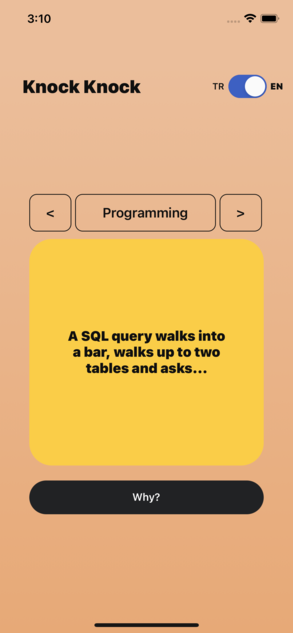
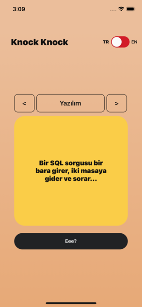

## Knock Knock Mobile App

Knock Knock is a mobile application developed using React Native. This app fetches jokes from a REST API and presents them to users. It utilizes Redux Fetch for data management, incorporates Lottie Animation library for engaging visuals, supports multiple languages, and enhances its interface with the Linear Gradient library.

# Features

- View jokes fetched from a REST API
- Manage data using Redux Fetch
- Multiple language support
- Enhanced visual experience with Lottie Animation library
- Stylish interface with the Linear Gradient library

# Screenshots

# Animation videos
https://github.com/osmanerdogan0/REST-Redux-ReactNative-JokeApp/assets/69325985/576afcd3-696b-473e-b031-0a0aaf854ddd

https://github.com/osmanerdogan0/REST-Redux-ReactNative-JokeApp/assets/69325985/76e1e8fb-6ef3-48b7-bd56-d245516fb0c0

https://github.com/osmanerdogan0/REST-Redux-ReactNative-JokeApp/assets/69325985/23d4d8d2-a715-42bd-966f-cdd9fee6b98e

